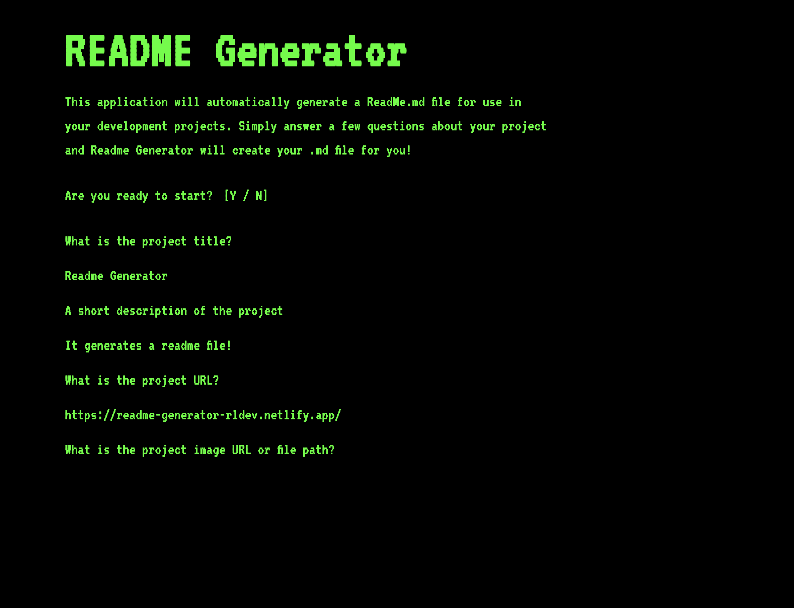

# Auto ReadMe

## Description

A command-line style application to seamlessly create a new ReadMe file for your projects quickly! This application will ask you all the right questions to generate a professional quality readme from the command line.

This project originally started as a Node.js command line application. I have since refactored it to become a frontend web application for easy access.

🚀 [https://auto-readme.pages.dev/](https://auto-readme.pages.dev/)

## Image

## Technologies
- Nuxt.js
- JavaScript
- TailwindCSS
- Cloudflare Pages

## License

This project is licensed under the [MIT](https://opensource.org/licenses/MIT) license.

## Contact

### Author: Ray Luna

If you have any questions about the repo, open an issue or contact me directly at:

- E-Mail: leon.luna.ray@gmail.com
- GitHub: [leon-luna-ray](https://github.com/leon-luna-ray)

## Links

- [https://auto-readme.pages.dev/](https://auto-readme.pages.dev/)
- [Project Repository](https://github.com/leon-luna-ray/auto-readme/)
