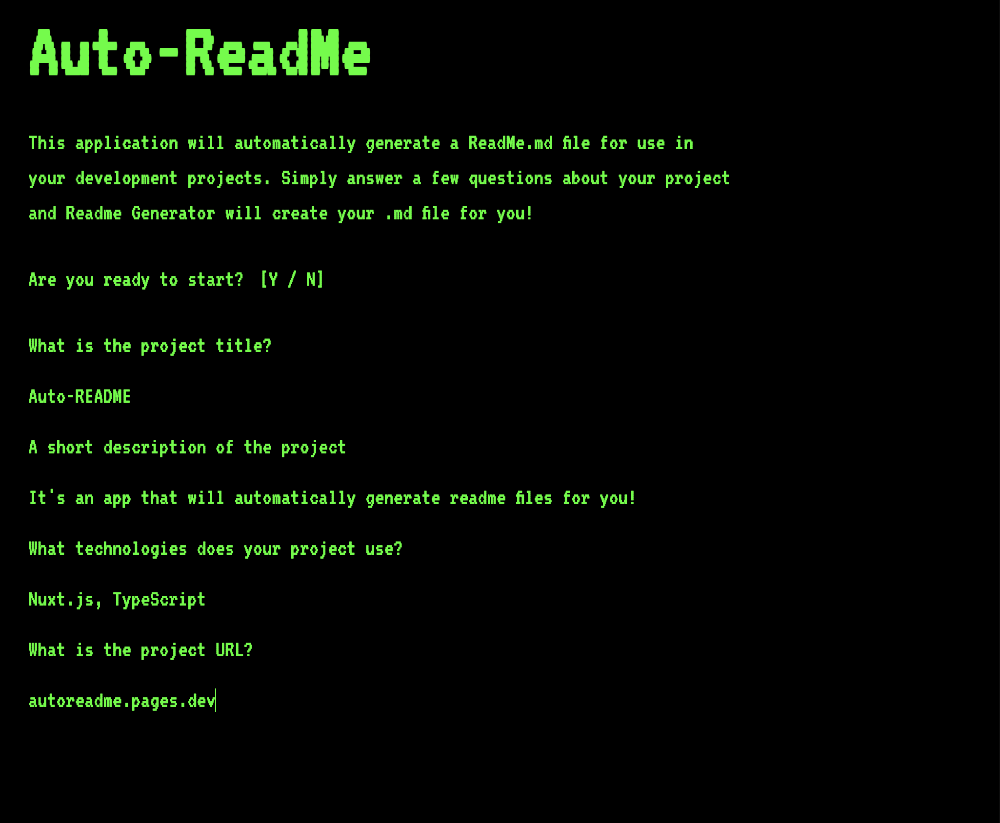

# Auto-README

## Description

Auto-README is an AI-powered Nuxt.js application designed to streamline the creation of professional README files. Styled with a command-line/computer terminal interface, this project blends modern web technologies with artificial intelligence.

Initially conceived as a Node.js CLI tool, Auto-README has been refactored into an accessible online platform. Users are guided through a series of questions, and their responses are then processed by Google's Generative AI to automatically generate a comprehensive and well-structured `README.md` file suitable for any project.

## Live Demo

[https://auto-readme.pages.dev/](https://auto-readme.pages.dev/)

## Screenshot



## Technologies

This project leverages a powerful stack of modern web development and AI technologies:

*   **[Nuxt](https://nuxt.com/)** - Intuitive Vue Framework for full-stack applications.
*   **[TypeScript](https://www.typescriptlang.org/)** - Strongly typed superset of JavaScript for enhanced developer experience and code quality.
*   **[Tailwind CSS](https://tailwindcss.com/)** - A utility-first CSS framework for rapidly building custom designs.
*   **[Vue.js](https://vuejs.org/)** - The progressive JavaScript framework powering the frontend UI.
*   **[Cloudflare Pages](https://pages.cloudflare.com/)** - For lightning-fast global deployment and serverless functions.
*   **[Google AI Studio](https://ai.google.dev/)** - The core AI engine for generating README content.

## Installation

To set up and run Auto-README locally, follow these steps:

### Prerequisites

*   [Node.js](https://nodejs.org/) (LTS version recommended)
*   [pnpm](https://pnpm.io/) (or npm/yarn)

### Setup

1.  **Clone the repository:**
    ```bash
    git clone https://github.com/leon-luna-ray/auto-readme.git
    cd auto-readme
    ```

2.  **Install dependencies:**
    ```bash
    pnpm install
    # Or using npm: npm install
    # Or using yarn: yarn install
    ```

3.  **Configure Environment Variables:**
    This project requires a Google Generative AI API key to function.
    Create a `.env` file in the root of the project and add your API key:

    ```dotenv
    NUXT_PUBLIC_GOOGLE_API_KEY="YOUR_GOOGLE_AI_STUDIO_API_KEY"
    ```
    You can obtain an API key from [Google AI Studio](https://ai.google.dev/).

## Usage

### Running Locally

After installation and configuration, you can run the application in development mode:

```bash
pnpm run dev
# Or using npm: npm run dev
# Or using yarn: yarn dev
```

The application will typically be accessible at `http://localhost:3000`.

### Generating a README

Once the application is running (locally or via the live demo):

1.  Navigate to the application URL.
2.  Follow the prompts in the terminal-like interface.
3.  Answer the questions about your project.
4.  The AI will then generate a professional README for you, which you can copy and use in your projects.

## Contributing

Contributions are welcome! If you have suggestions, bug reports, or want to contribute to the codebase, please feel free to:

1.  Fork the repository.
2.  Create a new branch (`git checkout -b feature/your-feature-name` or `bugfix/issue-description`).
3.  Make your changes.
4.  Commit your changes (`git commit -m 'feat: Add new feature'` or `fix: Resolve bug #123`).
5.  Push to the branch (`git push origin feature/your-feature-name`).
6.  Open a Pull Request.

Please ensure your code adheres to the project's coding style and includes appropriate tests if applicable.

## License

This project is licensed under the [MIT License](LICENSE).

## Contact

### Author: Ray Luna

If you have any questions about the repo, open an issue or contact me directly at:

- E-Mail: leon.luna.ray@gmail.com
- GitHub: [leon-luna-ray](https://github.com/leon-luna-ray)

## Links

- [View Project](https://auto-readme.pages.dev/)
- [Code Repository](https://github.com/leon-luna-ray/auto-readme/)
- [More Info](https://rayluna.dev/projects/auto-readme/)
